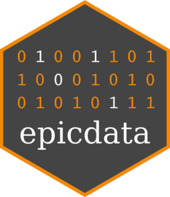

[](https://github.com/forsterepi/epicdata/actions/workflows/R-CMD-check.yaml)

# epicdata 

The goal of `epicdata` is to offer all necessary data processing
capabilities in a single package to deliver clean data for epidemiology.
With minimum effort and maximum control, `epicdata` turns your raw data
into data that can be analyzed. The package is suitable for non-veteran
R users. Metadata is specified as YAML in a format developed to be as
user-friendly and comprehensive as possible. Based on your metadata
specifications, `epicdata` will run a modular processing workflow, i.e.,
leaving out unnecessary steps. Processing will lead to changes in your
data, e.g., for off-format, missing, or invalid values. Since the
decisions regarding how to proceed with invalid values are not always
made by the data manager, decisions are collected in spreadsheet files.
Every single change to the data is logged and data documentation is
created automatically.

The `epicdata` workflow has been influenced by the concept of data
quality in observational health data of R package
[dataquieR](https://dataquality.qihs.uni-greifswald.de/IntroductoryTutorial.html).
However, while `dataquieR` focuses on quality reporting, this package
focuses on data processing.

**`epicdata` is currently under construction. Soon, there will be user
tests regarding the metadata YAML format. If you want to participate,
let me know.**

## Installation

You can install the development version of epicdata from
[GitHub](https://github.com/) with:

``` r
# install.packages("pak")
pak::pak("forsterepi/epicdata")
```
